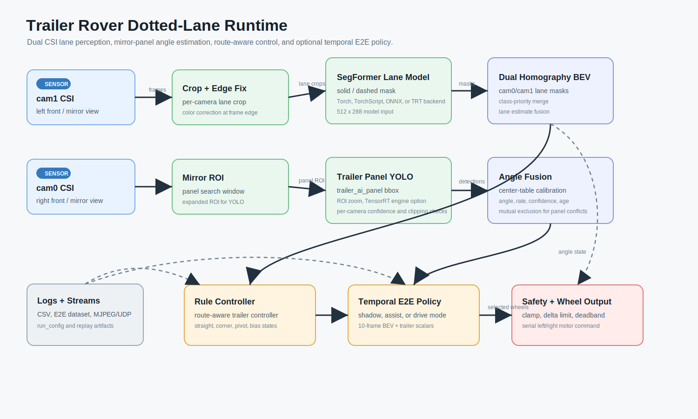
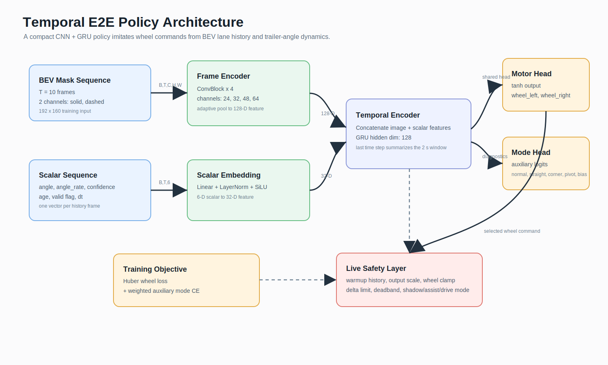
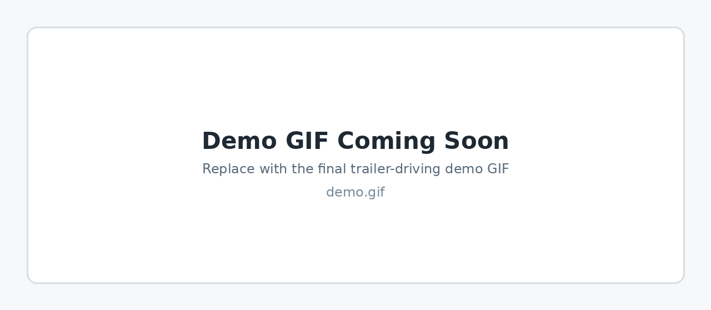
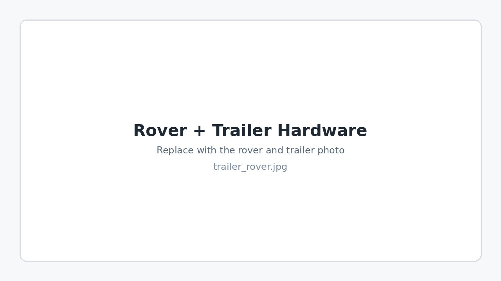
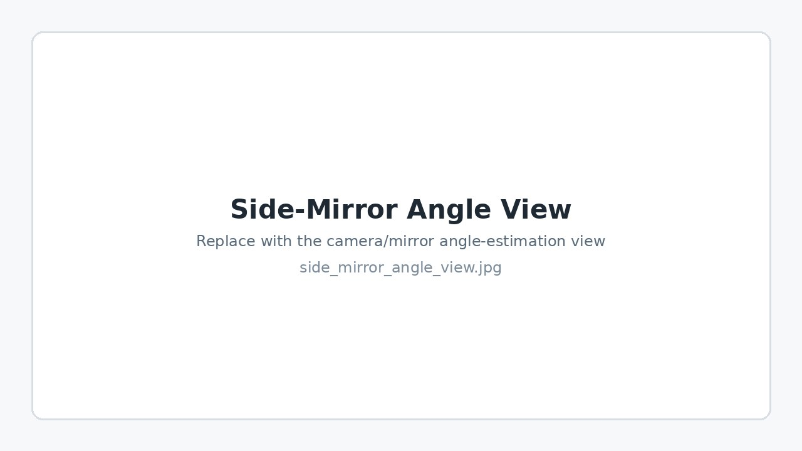

# Trailer E2E Dotted-Lane Following
> **Real-world trailer-rover lane-following system using dual-camera BEV perception, side-mirror trailer-angle estimation, and a temporal end-to-end motor policy.**

### 1. Project Overview
This repository contains a Jetson-based trailer driving stack for dotted-centerline lane following.  
Unlike a fixed-map controller, the Task 2 policy is trained from driving data and uses recent BEV lane history plus trailer-angle dynamics, allowing it to work on different dotted-lane maps when perception remains reliable.

* **Role:** Dual-camera perception, trailer-angle estimation, rule-controller design, E2E policy training, and live deployment
* **Platform:** Jetson Orin Nano, skid-steer rover, attached trailer, dual CSI cameras
* **Models:** SegFormer lane segmentation, YOLO trailer-panel detection, CNN-GRU temporal policy
* **Key Features:**
    * Dual-camera homography for fused BEV lane masks
    * Side-mirror-based trailer side-panel detection for angle estimation
    * Route-aware rule controller with straight, corner, pivot, and post-corner bias states
    * Temporal E2E policy with `shadow`, `assist`, and `drive` modes
    * Safety clamp, wheel delta limit, and warmup gating for live driving

---

### 2. System Architecture
Two front CSI cameras observe both the road and side mirrors.  
The mirror view reveals the trailer side panel, which is detected and converted into an articulation-angle estimate.



> **Figure 1.** Trailer-rover runtime pipeline: dual camera input, lane segmentation, side-mirror panel detection, angle fusion, controller/E2E policy, and motor output.

---

### 3. Temporal E2E Policy
The E2E model does not learn raw perception from scratch.  
Instead, lane segmentation and trailer-angle estimation are treated as stable intermediate representations, and the policy learns temporal control.



> **Figure 2.** CNN-GRU policy architecture using 10-frame BEV lane masks and trailer-angle scalar features.

#### Policy Boundary
* **Input:** 10-frame BEV lane mask sequence, trailer angle, angle rate, confidence, age, valid flag, and frame `dt`
* **Output:** left/right wheel commands
* **Auxiliary Output:** driving mode classification (`normal`, `straight`, `corner`, `pivot`, `bias`)

---

### 4. Hardware, Perception & Demo Media
The following media slots are prepared for the trailer hardware, side-mirror angle-estimation view, perception output, and final live demo.



> **Demo Slot.** Replace this placeholder by adding `docs/assets/demo.gif`.

#### Rover + Trailer Hardware
Add the rover and trailer photo as:

```text
docs/assets/trailer_rover.jpg
```



#### Side-Mirror Trailer-Angle View
Add the camera/mirror view used for angle estimation as:

```text
docs/assets/side_mirror_angle_view.jpg
```



---

### 5. Offline Validation Summary
The current temporal GRU was trained on E2E driving logs collected from the live rule-controller stack.

| Item | Value |
| :--- | :--- |
| History window | 10 frames |
| Approx. temporal coverage | 2.0 sec |
| BEV input | 2 channels, 192 x 160 |
| Scalar features | 6 |
| Validation wheel MAE | about `0.041` |
| Validation mode accuracy | about `95.5%` |

The validation set is small, so the final closed-loop demo is more important than the offline score alone.

---

### 6. Getting Started
Install the Jetson-compatible PyTorch wheel for your JetPack version first.  
Then install the remaining dependencies:

```bash
python3 -m pip install -r rover/requirements.txt
```

Place model artifacts as described in:

```text
rover/trailer_task/runs_yolo/README.md
rover/trailer_task/optimized_models/README.md
rover/trailer_task/e2e_temporal_policy/runs/README.md
track_riding/model_car_jetson/weights/README.md
```

Run the rule-controller stack:

```bash
cd rover/trailer_task
python3 live_dotted_lane_following.py --config dotted_lane_following_config.yaml
```

Run the temporal policy in shadow mode first:

```bash
python3 live_e2e_temporal_policy.py \
  --config dotted_lane_following_config.yaml \
  --e2e-mode shadow \
  --start-driving \
  --no-display \
  --no-stream \
  --no-http-stream
```

Direct E2E driving should be armed only after shadow logs look reasonable.

---

### 7. Main Configuration
The main runtime config is:

```text
rover/trailer_task/dotted_lane_following_config.yaml
```

Important sections:

* `camera`: dual CSI camera settings and per-camera crop/ROI
* `models`: segmentation and trailer-panel detector settings
* `angle`: trailer-angle calibration and filtering
* `bev`: dual homography calibration
* `lane`: dotted-lane geometry estimation
* `route_controller`: angle-aware route controller
* `e2e_live_policy`: temporal E2E live-driving settings

---

### 📂 Repository Structure
The path shape is preserved so imports keep working without changing the live demo code.

```text
.
├── README.md
├── docs/
│   ├── assets/                         # Demo GIF and hardware/media images
│   └── images/                         # Architecture diagrams
├── rover/
│   ├── requirements.txt
│   └── trailer_task/
│       ├── dotted_lane_following_config.yaml
│       ├── dual_bev_calibration.yaml
│       ├── live_dotted_lane_following.py
│       ├── live_e2e_temporal_policy.py
│       ├── trailer_route_controller.py
│       └── e2e_temporal_policy/
└── track_riding/
    └── model_car_jetson/
        └── scripts/lane_following_core.py
```

`lane_following_core.py` is copied as a small shared dependency from the model-car project.  
The original live-demo workspace is not modified.

---

### 8. Model Artifacts
Model binaries are excluded from Git and should be attached to GitHub Releases or stored with Git LFS.

Expected assets:

```text
rover/trailer_task/runs_yolo/trailer_panel_yolo11n/weights/best.engine
rover/trailer_task/optimized_models/segformer_b0_yellow_line_512x288.onnx
rover/trailer_task/e2e_temporal_policy/runs/temporal_gru_20260611_182905/best.pt
track_riding/model_car_jetson/weights/segmentation/segformer_b0_yellow_line_best_model/model.safetensors
```
